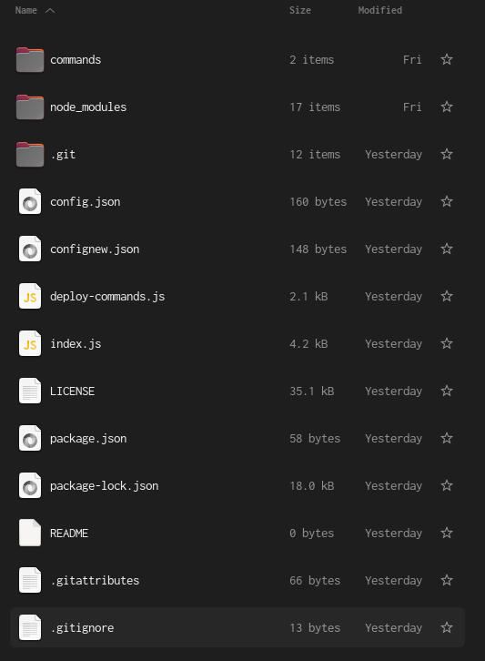

<br/>
<p align="center">
  <a href="https://github.com/kriptide/discord.js-bot-base">
    
  </a>

  <h3 align="center">Discord.js BOT Base.</h3>

  <p align="center">
    The simpliest discord.js bot written in javaScript and based on node modules. Easily customizable with my tutorial.
    <br/>
    <br/>
    <a href="https://github.com/kriptide/discord.js-bot-base"><strong>Explore the docs »</strong></a>
    <br/>
    <br/>
    <a href="https://github.com/kriptide/discord.js-bot-base">View Demo</a>
    .
    <a href="https://github.com/kriptide/discord.js-bot-base/issues">Report Bug</a>
    .
    <a href="https://github.com/kriptide/discord.js-bot-base/issues">Request Feature</a>
  </p>
</p>

    

## Table Of Contents

* [About the Project](#about-the-project)
* [Built With](#built-with)
* [Getting Started](#getting-started)
  * [Prerequisites](#prerequisites)
  * [Installation](#installation)
* [Roadmap](#roadmap)
* [Contributing](#contributing)
* [License](#license)
* [Authors](#authors)
* [Acknowledgements](#acknowledgements)

## About The Project



(This is how the main folder of this repo should look like).

Why I built that repo?
Here's why:
* Someone would need a "base" for coding their bot and is very lazy (or maybe not) to follow the official discord.js guide :tada:
* To make my (and yours) life easier (I needed the simpliest bot). :green_heart:
* For fun. I like that type of stuff.

It is just the full functional base. The name of the bot, it's profile picture, are dependent from the BOT Token you will put in the config.json file.


## Built With


* [node.js](https://github.com/nodejs)
* [discord.js](https://github.com/discordjs/discord.js)
* [javaScript]()

## Getting Started

101 - How to configure the bot and how to launch it.

### Prerequisites

This is an example of how to list things you need to use the software and how to install them.

* node.js
* npm

Installation tutorial:
```sh
> sudo apt install nodejs && sudo apt install npm     - (Ubuntu/Debian/LMint)
> sudo pacman -S nodejs && sudo pacman -S npm     - (Arch/Manjaro)
> sudo dnf install nodejs && sudo dnf install npm     - (Fedora)
> https://nodejs.org/en/download    - (Windows / macOS / Linux standalone packages)

```

### Installation

1. Clone git repo somewhere
2. Go to the folder, open terminal/cmd in that place, enter ***npm install*** to install all the needed node modules.
3. Rename confignew.json to config.json
4. Enter the config.json
5. Go to [Discord Developer Portal](https://discord.com/developers/applications)
6. Login to Discord with your account
7. Click on Applications
8. Create New Application, enter its name and accept ToS
9. Click "BOT" Bookmark, enter BOT name you want to use and click Reset Token
10. **Copy Token (DO NOT PUBLISH THE TOKEN ANYWHERE!)**
11. Paste the token into config.json file (into token: "here")
12. Go back to Developer Portal, then click OAuth2 bookmark
13. **copy ClientID** and paste it into config.json file (into clientId: "here")
14. Go to Discord app, go to settings, scroll down to Developer Settings, enable them
15. Go back to homescreen, then click the right button on your server on which you want to add the bot, then **copy server ID**
16. Paste it into config.json (into guildId: "here")
17. **(Optionally)** Enter the /commands/(any .js) file and customize the messages' outputs.
18. ***When your Bot is ready to deploy (You've set the Token, ClientID, GuildID, {Bot's name, Bot's Profile Picture and Bot's description - on Developer Portal), it is time to invite the bot to your server:***
Paste the bot's ClientID into the link:
discord.com/api/oauth2/authorize?client_id=***pastetheclientIDhere***&permissions=8&scope=bot%20applications.commands

19. When the bot joined the server, it is time to **Launch the bot:**
20. Open cmd / terminal
21. cd to your cloned repo directory
22. Check if you chose the right directory: **ls**  command on macOS/Linux or **dir** on Windows OS.
23. If yes - run the command: **node index.js**
24. Bot should output in the terminal window the message: **karolBot | Deployed! Running instance name: [YourBotNameHere#0000]**.

***Or.... if it does not work... open Issue on GitHub and we'll solve the problem together :cat:***


## Roadmap

See the [open issues](https://github.com/kriptide/discord.js-bot-base/issues) for a list of proposed features (and known issues).

## Contributing

Contributions are what make the open source community such an amazing place to be learn, inspire, and create. Any contributions you make are **greatly appreciated**.
* If you have suggestions for adding or removing projects, feel free to [open an issue](https://github.com/kriptide/discord.js-bot-base/issues/new) to discuss it, or directly create a pull request after you edit the *README.md* file with necessary changes.
* Please make sure you check your spelling and grammar.
* Create individual PR for each suggestion.
* Please also read through the [Code Of Conduct](https://github.com/kriptide/discord.js-bot-base/blob/main/CODE_OF_CONDUCT.md) before posting your first idea as well.

### Creating A Pull Request

1. Fork the Project
2. Create your Feature Branch (if you want to add something cool to the bot  :+1:)
(`git checkout -b feature/NewFeature`)
3. Commit your Changes (`git commit -m 'Add some newFeature'`)
4. Push to the Branch (`git push origin feature/newFeature`)
5. Open a Pull Request

## License

GNU GPLv3. That's all.

## Authors

* **kriptide** - *High School Programmer* - [kriptide's profile](https://github.com/kriptide/) - *Author of the entire repo.*

## Acknowledgements

* [Discord.js Complete Guide](https://discordjs.guide/#before-you-begin)
* [Node.js Guide (W3Schools)](https://www.w3schools.com/nodejs/)
* [javaScript Tutorials (W3Schools)](https://www.w3schools.com/js/default.asp)
